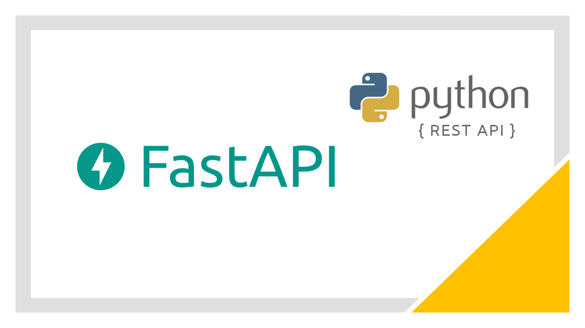

# PYTHON FASTAPI DEVELOPMENT BOOTH




Welcome to the FastAPI Python API Development project repository. This comprehensive repository demonstrates modern best practices for building robust, high-performance, and efficient APIs using FastAPI in Python. It incorporates various technologies, including unit testing, continuous integration/deployment (CI/CD) with Docker and Heroku, database migration tools (Alembic), authentication with JWT tokens, virtual environment management, relational databases (Postgres), Uvicorn ASGI web server, and example routes showcasing different features. [Recommendation: Sanjeev Thiyagarajan - Python FastAPI Full Course](https://youtube.com/playlist?list=PL8VzFQ8k4U1L5QpSapVEzoSfob-4CR8zM&feature=shared).

## TECHNOLOGIES USED

- **FastAPI:** A modern, fast (high-performance), web framework for building APIs with Python 3.7+ based on standard Python type hints.
- **Unit Testing:** Demonstrates the importance of testing through unit tests for different components of the API.
- **CI/CD (Docker, Heroku):** Implements continuous integration and deployment using Docker for containerization and Heroku for cloud hosting.
- **Database Migration Tools (Alembic):** Incorporates Alembic for managing database schema migrations.
- **Authentication (JWT Tokens):** Implements token-based authentication using JWT (JSON Web Tokens).
- **Virtual Environment:** Utilizes virtual environments for dependency isolation and management.
- **Relational Databases (Postgres):** Integrates with Postgres as a relational database to store and manage data.
- **Uvicorn ASGI Web Server:** Uses Uvicorn as the ASGI (Asynchronous Server Gateway Interface) web server for FastAPI.
- **GitHub Jobs:** Example routes that demonstrate fetching data from the GitHub Jobs API.
- **SQLAlchemy:** An SQL toolkit and Object-Relational Mapping (ORM) library for Python, used for database interaction.

## PROJECT STRUCTURE

- **`app/`:** Main directory containing the FastAPI application code and different routes.
- **`diagrams/`:** Directory containing diagrams illustrating system architecture, database schema, or any relevant visualizations.
- **`proxy/`:** Directory with configurations for a reverse proxy, enabling seamless deployment and routing.
- **`alembic/`:** Alembic configurations and migration scripts for managing database schema changes.
- **`requirements.txt`:** File listing project dependencies for easy installation.
- **`Dockerfile`:** Configuration for building a Docker image of the FastAPI application.
- **`README.md`:** General documentation providing an overview of the project and instructions for setup and deployment.

## DATABASE TABLES DESIGN & RELATIONSHIPS


---

### REQUIREMENTS: Quick Setup/Guidelines for Running the Python API

- ###### Creating the Python Virtual Environment:
    ```markdown
    - sudo apt-get update
    - sudo apt-get install python3-venv
    - python3 -m venv venv

    - pip install virtualenv
    - virtualenv -p python3 <env_name>
    - source <env_name>/bin/activate
    - deactivate
    ```

- ###### Activating the Python Virtual Environment:
    ```markdown
    - source venv/bin/activate
    ```

- ###### Deactivating the Python Virtual Environment:
    ```markdown
    - deactivate
    ```

- ###### FastAPI:
    ```markdown
    - pip install fastapi[all]
    - pip freeze
    - python.exe -  pip install autopen8
    - Running the API:
        - univorn app/main:app
        - uvicorn app.main:app --host 127.0.0.1 --port 8000 --reload (for automatic updates)

- ###### Environment Variables:
    ```bash
    # Place the (.env) File in Root Directory
    DATABASE_HOSTNAME='DATABASE_HOSTNAME'
    DATABASE_PORT='DATABASE_PORT'
    DATABASE_PASSWORD='DATABASE_PASSWORD'
    DATABASE_NAME='DATABASE_NAME'
    DATABASE_USERNAME='DATABASE_USERNAME'
    SECRET_KEY='SECRET_KEY'
    ALGORITHM='ALGORITHM'
    ACCESS_TOKEN_EXPIRE_MINUTES='ACCESS_TOKEN_EXPIRE_MINUTES'
    ```
---
---

## FINALLY WE GETTING STARTED WITH THE BEST PART

- **Clone the Repository:**
   ```bash
   git clone https://github.com/TebogoYungMercykay/Python_API_Development_Booth_FASTAPI.git
   cd yourproject
   ```

- **Install Dependencies:**
    ```bash
    pip install -r requirements.txt

    # Alternatively use the script to avoid some installation errors
    bash myscript.sh
    ./myscript.sh

    # If you encounter a permission error, you may need to make the script executable. You can do this with the following command:
    chmod +x myscript.sh
    ./myscript.sh
    ```

- **Run Locally:**
    ```bash
    uvicorn app.main:app --host 127.0.0.1 --port 8000 --reload
    ```

- **Access API Documentation:**
   Open your browser and navigate to [http://127.0.0.1:8000/docs](http://127.0.0.1:8000/docs) for interactive API documentation.

---

## SOME MORE DETAILS ABOUT THE DEVELOPMENT

- #### DevOps CI/CD and Deployment

    - **Docker:**
    Build a Docker image and run the application in a container.

    - **Heroku:**
    Deploy the application to Heroku using the provided configurations.

- #### Database Migration

    - **Alembic:**
    Manage database schema migrations using Alembic.

- #### API URL & Documentation

    - Comprehensive documentation for each module and route is available in the API documentation.
    - The API can be accessed at [api-endpoint-url](https://healthconnect-python-fastapi-9b23b53a9ae4.herokuapp.com/).
    - Documentation URL: https://healthconnect-python-fastapi-9b23b53a9ae4.herokuapp.com/docs

## ADDITIONAL INFORMATION FOR THE READER

Feel free to explore the various directories and components to understand different aspects of FastAPI development. The provided diagrams offer visual insights into the system architecture and database structure. The reverse proxy configurations in the `proxy/` directory enhance deployment flexibility.

## MIT - LICENSE AGREEMENT

Copyright (c) 2023 Selepe Sello

Permission is hereby granted, free of charge, to any person obtaining a copy of this software and associated documentation files (the "Software"), to deal in the Software without restriction, including without limitation the rights to use, copy, modify, merge, publish, distribute, sublicense, and/or sell copies of the Software, and to permit persons to whom the Software is furnished to do so, subject to the following conditions:

The above copyright notice and this permission notice shall be included in all copies or substantial portions of the Software.

THE SOFTWARE IS PROVIDED "AS IS", WITHOUT WARRANTY OF ANY KIND, EXPRESS OR IMPLIED, INCLUDING BUT NOT LIMITED TO THE WARRANTIES OF MERCHANTABILITY, FITNESS FOR A PARTICULAR PURPOSE AND NONINFRINGEMENT. IN NO EVENT SHALL THE AUTHORS OR COPYRIGHT HOLDERS BE LIABLE FOR ANY CLAIM, DAMAGES OR OTHER LIABILITY, WHETHER IN AN ACTION OF CONTRACT, TORT OR OTHERWISE, ARISING FROM, OUT OF OR IN CONNECTION WITH THE SOFTWARE OR THE USE OR OTHER DEALINGS IN THE SOFTWARE.

---
---

<p align="center">The End, Thank You!</p>

---
